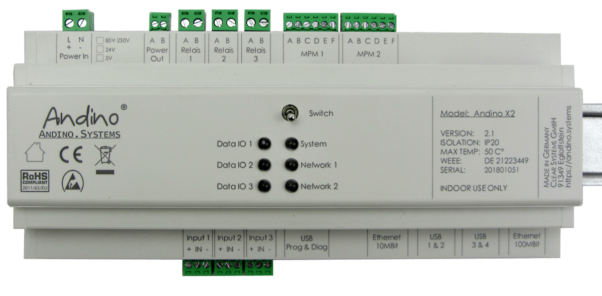
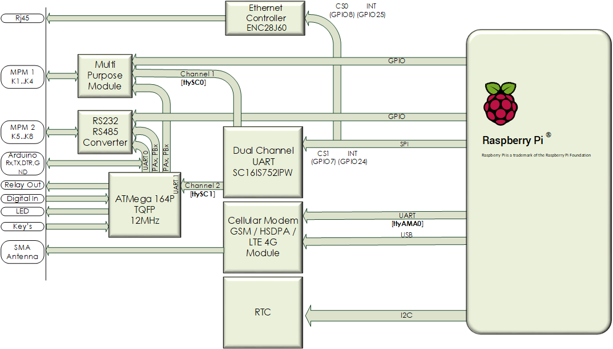
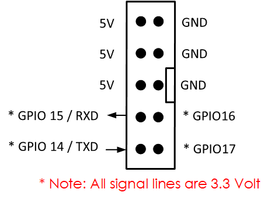

# Andino X2

Tabe of Content   
   
1. [Digital inputs](README.md#digital-inputs)
2. [Relay outputs](README.md#relay-output)

## Documentation

----------

### Digital Inputs
The digital inputs are connected to the Atmel Controller.  
The default firmware will debounce the inputs and send changes and a change counter cyclical to the Pi.
Please see here for a description of the firmware:  
[https://github.com/andino-systems/Andino-X2/tree/master/src/firmware](https://github.com/andino-systems/Andino-X2/tree/master/src/firmware)
  
The Inputs are calculated for 24 Volt Input.  

The Inputs can be driven by an external power supply (active mode) or with a "dry contact" with the internal voltage.   
For the  "dry contact" the internal jumper has to be closed. This will connect the "minus" contact with the ground of the board so this not a 100% isolated mode.   

----------
### Relay Output
The Ralay are also controlled by the Atmel Controller. The default firmware can turn them on/off or pulse them.  
This will be done by the command:   
    REL1 1   
    REL1 0   
    REL2 1   
    REL2 0   
    RPU1 1500   
PRU1 1500 Pulses the relay 1 for 1500 ms.
Please see here for more details about the default firmware:   
[https://github.com/andino-systems/Andino-X2/tree/master/src/firmware](https://github.com/andino-systems/Andino-X2/tree/master/src/firmware)

----------
### Prepare the Debian
1. Release the ttyAMA0 from getty and asign it to GIO14, GPIO15
2. Add a driver for the SPI UART
3. Add a driver for the SPI Ethernet controller

#### Enable UART to GPIO

The UART on the GPIO is used for the 2G/GPRS Modem 

    sudo nano /boot/config.txt

add this at the end of the file..

    enable_uart=1   
    dtoverlay=pi3-disable-bt-overlay
    dtoverlay=pi3-miniuart-bt   

Stop getty on serial0:   

    sudo nano /boot/cmdline.txt 

Remove “**console=…**   
dwc_otg.lpm_enable=0 **console=serial0,115200 console=tty1** root=/dev/mmcblk0p2 rootfstype=ext4 .....

#### Add the Driver for the SPI UART

The first channel goes to the MPM Slot 1.
The second  channnel of the SPI UART is used to communicate with the Atmel Controller.

    cd ~/
    wget https://github.com/andino-systems/Andino-X2/raw/master/src/sc16is752-spi0-ce1.dtbo
    sudo cp sc16is752-spi0-ce1.dtbo /boot/
    sudo nano /boot/config.txt
Add or uncomment this  

    dtparam=spi=on
    dtoverlay=sc16is752-spi0-ce1

Then
    
    sudo reboot now
    ls /dev/ttySC*

ttySC0 – to MPM1   
ttySC1 – to Arduino   

Test the UART. (You can exit with CTRL-A then X)

    sudo nano minicom –setup
    # press Serial Port Setup

    +-----------------------------------------------------------------------+
    | A -    Serial Device      : /dev/ttySC1                               |
    | B - Lockfile Location     : /var/lock                                 |
    | C -   Callin Program      :                                           |
    | D -  Callout Program      :                                           |
    | E -    Bps/Par/Bits       : 38400 8N1                                 |
    | F - Hardware Flow Control : No                                        |
    | G - Software Flow Control : No                                        |
    |                                                                       |
    |    Change which setting?                                              |
    +-----------------------------------------------------------------------+
            | Screen and keyboard      |
            | Save setup as dfl        |
            | Save setup as..          |
            | Exit                     |
            | Exit from Minicom        |
            +--------------------------+

#### Add a driver for the SPI Ethernet controller

    sudo nano /boot/config.txt
add at the end:  
 
dtoverlay=enc28j60

    sudo reboot now
    ...
    ifconfig
    eth0: flags=4163<UP,BROADCAST,RUNNING,MULTICAST>  mtu 1500
    inet 192.168.178.74  netmask 255.255.255.0  broadcast 192.168.178.255
    inet6 fe80::50a1:6c17:239b:847c  prefixlen 64  scopeid 0x20<link>
    ether b8:27:eb:45:a3:bc  txqueuelen 1000  (Ethernet)
    RX packets 2077  bytes 186482 (182.1 KiB)
    RX errors 0  dropped 3  overruns 0  frame 0
    TX packets 1649  bytes 257186 (251.1 KiB)
    TX errors 0  dropped 0 overruns 0  carrier 0  collisions 0
    
    eth1: flags=4099<UP,BROADCAST,MULTICAST>  mtu 1500
    ether c6:97:8d:3a:22:b6  txqueuelen 1000  (Ethernet)
    RX packets 0  bytes 0 (0.0 B)
    RX errors 0  dropped 0  overruns 0  frame 0
    TX packets 0  bytes 0 (0.0 B)
    TX errors 0  dropped 0 overruns 0  carrier 0  collisions 0
    device interrupt 191
    
----------
### Communication with the Atmel Controller

The UART communication with the Atmel Controller can be switched to either the Raspberry Pi or a external PC with a USB Adapter. With this the firmware development can be easily done with a PC.
The selection is done by two jumpers.

If the Jumpers are pluged in the communication is between the Pi and the Atmel.    
If the Jumpers are *not*  pluged in, the communication is between the Atmel and the PC.

#### Atmel Controller <-> Raspberry Pi

The device to communicate with the Atmel is /dev/ttySC1  
The Baudrate with the default firmware is 38400 Baud with 8/n/1 and no hardware flow control.
You can easily check this with minicom

    sudo aptget install minicom
    sudo minicom --setup
    
Use ctrl-a and then x to exit minicom. 
   
#### Atmel Controller <-> PC via USB

The Andino X2 allows to program the Atmel Controller from the Raspberry Pi with avrdude or from a PC via a USB Adapter.  
This Adapter is available at our shop or from ebay.  

  
The Jumper at the Atmel connection Selector must not be pluged in.   

To program the Atmel Controller with the Arduino IDE just install the Mighty Core Boards.  
Please visit this site [https://github.com/MCUdude/MightyCore](https://github.com/MCUdude/MightyCore) and see the section "How to install"  
Use this settings inside the Arduino IDE:  
  

The initial firmware installed on the X2 and the settings can be found here:    
[https://github.com/andino-systems/Andino-X2/tree/master/src/firmware](https://github.com/andino-systems/Andino-X2/tree/master/src/firmware)

----------
### Communication with Modem (optional)

----------
### Drive the LED from Raspberry

----------
### Firmware for the Atmel Controller
Please see here   
[https://github.com/andino-systems/Andino-X2/tree/master/src/firmware](https://github.com/andino-systems/Andino-X2/tree/master/src/firmware)
